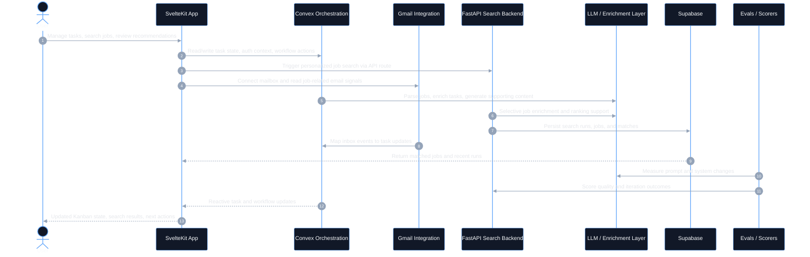
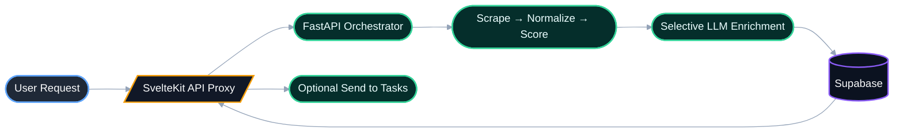

# JobPilot

**AI-powered job orchestration system with production-oriented full-stack architecture.**

JobPilot is an open-source platform for managing job applications, running personalized job search workflows, and integrating AI into real user operations without reducing the system to prompt-only automation.

---

## Overview

JobPilot is designed around a simple product goal: help users run a serious, structured job search with less manual coordination.

At the product level, it combines:

- a **Kanban workflow** for application tracking
- a **personal search engine** for discovery, scoring, and filtering
- **Gmail-assisted automation** for detecting interview, rejection, and acceptance signals
- **AI-assisted task execution** for parsing jobs, enriching records, and generating application artifacts

At the engineering level, the project demonstrates how to build an AI-enabled system with explicit boundaries, persistence layers, failure handling, deployment discipline, and evaluation loops.

This repository (`job-promus`) is the main application layer for JobPilot. It is backed by a broader multi-service workspace that includes a dedicated Python search backend, data/evaluation modules, and deployment infrastructure.

---

## Key Features

- **Kanban-based job application tracking** with structured stages and task metadata
- **AI task assistant** for parsing job descriptions, enriching task details, and generating motivation-letter content
- **Gmail integration** that detects operational job-search signals and maps them into task updates
- **Personal job search engine** with scraping, normalization, scoring, filtering, and persistence
- **Power search mode** for extended search behavior and higher-coverage runs
- **Hybrid enrichment pipeline** combining heuristics with LLM-assisted refinement
- **Task-agent reliability features** including cleanup flows, retry-aware logic, and stuck-state recovery
- **Full-stack app orchestration** across SvelteKit, Convex, Supabase, and external APIs
- **Evaluation-oriented development** through a dedicated `evals/` module with datasets and scorers
- **Production-minded deployment setup** spanning environment-specific configuration, CI checks, and serverless deployment workflows

---

## System Architecture

JobPilot is not a single UI app with an API wrapper. It is a multi-component system with clear responsibilities across frontend orchestration, backend services, persistence, AI workflows, and evaluation.

### Core components

#### 1. Main App (`job-promus`)

- Built with **SvelteKit**
- Serves the main product UI and route orchestration
- Handles authentication, Kanban workflows, Gmail connection UX, task interactions, and personal search presentation

#### 2. Application Backend / Reactive State Layer

- Built on **Convex**
- Handles user state, task persistence, Gmail token storage, agent orchestration, support workflows, and reactive queries/mutations/actions

#### 3. Personal Search Backend (`job-personal-search`)

- Built with **Python + FastAPI**
- Handles scraping, normalization, deduplication, ranking, and search orchestration
- Persists structured search outputs to **Supabase/Postgres**

#### 4. Data & Persistence

- **Convex** for application state and orchestration data
- **Supabase/Postgres** for search profiles, runs, canonical jobs, and match persistence

#### 5. Evaluation Layer (`/evals`)

- Datasets, scorers, and result tracking for iterative improvement
- Supports measurable prompt/system changes rather than intuition-only tuning

### Architecture diagram

The sequence below shows the high-level runtime interaction between the user-facing app, orchestration layer, search backend, persistence, and evaluation loop.



### Concrete system facts

- The main app is implemented in **SvelteKit** and uses **Convex** for reactive backend state, mutations, actions, and orchestration.
- Personalized search runs through a separate **FastAPI** service, which keeps scraping/ranking concerns outside the UI runtime.
- Search results are persisted in **Supabase/Postgres**, while task/application state lives in **Convex**.
- Gmail integration is not cosmetic: inbox events are converted into task-level operational signals such as interview, rejection, and follow-up updates.
- Enrichment is **heuristic-first** and uses LLMs selectively rather than treating every record as a model call.
- The workspace includes a dedicated **evaluation loop** with datasets and scorers to track quality improvements over time.
- The system includes **cleanup and stuck-state handling** for task-agent workflows, reflecting attention to failure modes rather than just happy-path UX.
- Deployment is split across app/runtime boundaries with environment-specific configuration, CI workflows, and serverless-friendly packaging patterns.

---

## Engineering Highlights

### Hybrid AI logic, not blind prompt chaining

LLMs are used inside bounded workflows rather than as a substitute for application logic. The system combines:

- deterministic heuristics
- structured persistence
- domain-specific matching/scoring
- selective enrichment
- user-authenticated AI actions where appropriate

### Reliability-aware task orchestration

The task/agent flow includes explicit handling for real operational issues such as:

- stale or stuck work items
- error-state cleanup
- duplicate-prevention logic
- controlled retry behavior
- user-visible state transitions

### Clear system boundaries

The repository reflects architectural separation between:

- product UI and route orchestration
- reactive backend logic
- search-specific scraping/ranking services
- persistence responsibilities
- evaluation and iteration workflows

### Production-oriented trade-offs

The project shows practical engineering decisions around:

- environment-based configuration
- rate-limit and runtime budget awareness
- selective LLM usage instead of maximum LLM usage
- deployment packaging and CI automation
- maintaining local/dev/prod paths across multiple services

---

## AI System Design

JobPilot uses AI as a system component, not a UI gimmick.

### Where LLMs are used

- job/task parsing
- motivation-letter generation support
- selective enrichment of job records
- keyword suggestion from user profile/CV context
- support/task-assistant workflows

### How LLMs are used responsibly

- **heuristics-first where possible** to reduce unnecessary model usage
- **batched or selective enrichment** for cost and latency control
- **structured app logic around model calls** rather than free-form agent behavior everywhere
- **explicit persistence and post-processing** so outputs become usable application state
- **user-authenticated and environment-aware flows** where external model access is involved

### What this avoids

- naive “send everything to a model” architecture
- undocumented prompt-only business logic
- hiding failure cases behind a chat interface

The result is a system where AI is useful because it is integrated into the surrounding engineering constraints.

### Search pipeline at a glance

The personalized search subsystem is intentionally separated from the UI runtime. The flow below highlights the minimal data path from user request to persisted, ranked results.



---

## Evaluation & Iteration

The wider workspace includes a dedicated `evals/` module with:

- datasets
- scorers
- reproducible evaluation runs
- before/after results tracking

This matters because prompt or workflow changes are not treated as purely subjective improvements. The evaluation layer supports:

- baseline measurement
- failure analysis
- trace-based debugging
- scorer-driven iteration
- measurable improvement loops

This is an important part of the project’s engineering maturity: AI behavior is improved through instrumentation and evaluation, not only ad hoc manual inspection.

---

## Deployment & Infrastructure

The repository is set up with production-minded deployment patterns rather than a local-only developer experience.

### App and backend deployment

- **SvelteKit app build** via Bun/Vite
- **Convex** for backend deployment and runtime state management
- **Vercel-oriented configuration** for the main web app
- **Lambda-style deployment structure** in the broader workspace for Python services

### Infrastructure characteristics

- environment-specific configuration files for local, CI, deployment, and backend runtime
- GitHub Actions workflows for static checks and preview/e2e automation
- deployment scripts and packaging support across services
- support for serverless/cloud execution models

### Persistence and runtime integrations

- Convex for app/runtime state
- Supabase/Postgres for structured search data
- Gmail OAuth for inbox-driven workflow updates
- analytics and operational integrations where needed

---

## Getting Started

The full system spans multiple services, but the main app can be started locally with a realistic development workflow.

### Prerequisites

- **Bun**
- **Node.js**
- **Convex account/project**
- optional: **Supabase project** for personal search
- optional: Gmail / Resend / analytics credentials depending on which integrations you want active

### 1. Install dependencies

```bash
bun install
```

### 2. Configure environment variables

Create local environment files from the provided examples as needed:

- `.env.local`
- `.env.convex.local`
- `.env.deployment.example`
- `.env.test.example`

At minimum, local development typically requires values for:

- `CONVEX_DEPLOYMENT`
- `PUBLIC_CONVEX_URL`
- personal search API / Supabase variables if using the job-search subsystem
- optional auth/email/analytics variables depending on enabled features

### 3. Run the main app and Convex backend

```bash
bun run dev
```

This runs:

- SvelteKit frontend
- Convex development backend

### 4. Run checks

```bash
bun run check
bun run lint
bun run test
```

### 5. Personal search backend

The personalized search engine lives in the separate `job-personal-search/` service. If you want full end-to-end search behavior, run that backend and connect the SvelteKit proxy route to it through the configured API URL.

---

## Open Source & Philosophy

JobPilot is **free to use**.

The intent behind open-sourcing it is twofold:

- make the tool usable and inspectable by others
- demonstrate how AI can be embedded into real user workflows with stronger engineering discipline than a demo-first prototype

The project also includes an **optional donation/support path** for people who want to help sustain development, but the core philosophy is that the system should remain useful without turning access into a paywall.

---

## Acknowledgment

This project was originally inspired by earlier work and starter foundations, but the current system has been substantially extended into a broader multi-component product with:

- a job-search backend
- AI-assisted orchestration
- Gmail-driven operational updates
- evaluation workflows
- production-oriented architecture decisions

The result is meaningfully beyond a template or hackathon-only prototype.

---

## Author Positioning

JobPilot reflects a combination of skills expected from an **AI Engineer / ML Systems Engineer / AI Solutions Engineer**:

- full-stack product development across frontend, backend, and data boundaries
- AI workflow design with explicit operational constraints
- evaluation-driven iteration instead of prompt-only experimentation
- reliability thinking around failure recovery and state cleanup
- infrastructure awareness spanning deployment, configuration, CI, and service separation

For hiring managers and technical reviewers, the strongest signal in this project is not just “uses AI,” but **how AI is integrated into a real system with architecture, measurement, and operational ownership**.

---

## License

MIT
